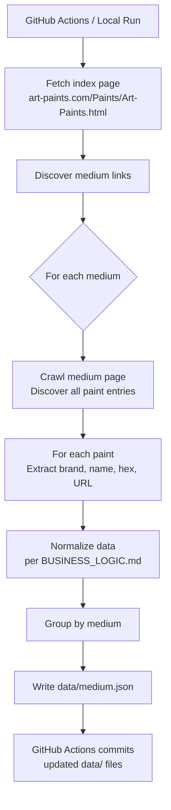

# Architecture — paint-crawl

## Overview

paint-crawl is a single-purpose Python pipeline that crawls art-paints.com, extracts paint data, and writes normalized JSON files to the `data/` directory. It runs locally on demand or automatically on a schedule via GitHub Actions, which commits the updated files back to the repository.

No server. No database. No external dependencies beyond Python libraries and GitHub.

---

## Pipeline



---

## Components

### Crawler (`crawler.py`)
- Entry point for the pipeline
- Fetches the index page and discovers medium links
- Iterates through mediums, fetching each medium's page
- Delegates HTML parsing to the parser module

### Parser (`parser.py`)
- Accepts raw HTML, returns structured paint data
- Extracts: brand, color name, hex value, source URL
- Returns `hex: null` and `hex_available: false` when no hex is found

### Normalizer (`normalizer.py`)
- Applies cleaning rules to raw extracted data
- Rules defined in `BUSINESS_LOGIC.md`

### Writer (`writer.py`)
- Groups normalized paints by medium
- Writes one JSON file per medium to `data/`
- Adds `crawled_at` timestamp envelope

---

## Technology

| Concern | Choice | Reason |
|---------|--------|--------|
| Language | Python 3.x | Ecosystem fit for scraping |
| HTTP | `requests` | Simple, stable, well-documented |
| HTML parsing | `BeautifulSoup4` | Standard for static HTML scraping |
| Scheduling | GitHub Actions | Free, no infrastructure to manage |
| Storage | JSON files in repo | No database needed for MVP |

---

## GitHub Actions Workflow

File: `.github/workflows/crawl.yml`

- **Trigger:** Weekly schedule (configurable) + manual dispatch
- **Steps:**
  1. Check out the repository
  2. Set up Python
  3. Install dependencies (`pip install -r requirements.txt`)
  4. Run the crawler (`python crawler.py`)
  5. Commit and push any changes to `data/` with message: `chore: update paint data [YYYY-MM-DD]`
- **Permissions:** Write access to repo contents (for committing data files)
- **No secrets required** — art-paints.com requires no authentication

---

## Directory Layout

```
paint-crawl/
  crawler.py          ← entry point
  parser.py           ← HTML extraction
  normalizer.py       ← data cleaning
  writer.py           ← JSON output
  requirements.txt    ← Python dependencies
  data/               ← generated output (committed to repo)
    oils.json
    acrylics.json
    ...
  .github/
    workflows/
      crawl.yml       ← GitHub Actions workflow
  hacky-hours/        ← framework docs
```

---

## Constraints

- **Rate limiting:** The crawler must add a polite delay between requests (see `BUSINESS_LOGIC.md`). art-paints.com is a small site — don't hammer it.
- **robots.txt:** Check and respect `art-paints.com/robots.txt` before crawling.
- **No credentials:** The workflow requires no API keys or secrets.
- **MVP scope:** One source site only (art-paints.com). Additional sources are a V2+ consideration.
