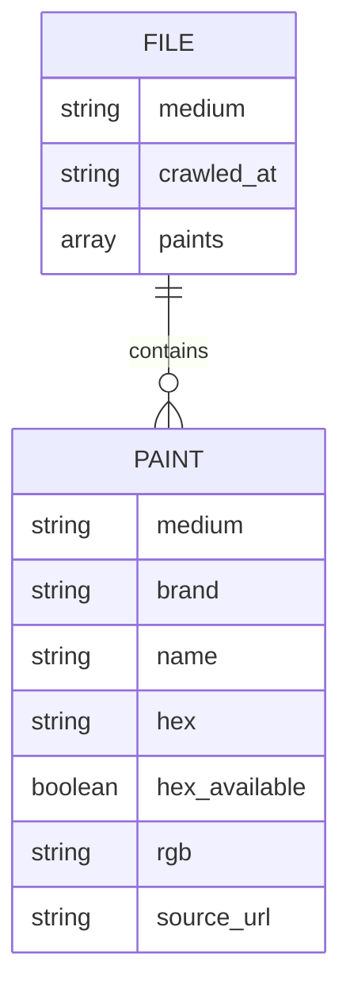

# Data Model — paint-crawl

## Output Structure

One JSON file per painting medium, written to the `data/` directory at the project root.

```
data/
  oils.json
  acrylics.json
  watercolors.json
  gouache.json
  ... (one file per medium discovered on art-paints.com)
```

File naming: lowercase, hyphens for multi-word mediums (e.g., `oil-pastels.json`).

---

## File Schema

Each file is a wrapped object containing metadata and a `paints` array.

```json
{
  "medium": "oils",
  "crawled_at": "2026-04-21T00:00:00Z",
  "paints": [
    {
      "medium": "oils",
      "brand": "Winsor & Newton",
      "name": "Cadmium Red",
      "hex": "#e32636",
      "hex_available": true,
      "rgb": "227, 38, 54",
      "source_url": "http://www.art-paints.com/Paints/Oils/..."
    },
    {
      "medium": "oils",
      "brand": "Winsor & Newton",
      "name": "Ivory Black",
      "hex": null,
      "hex_available": false,
      "rgb": null,
      "source_url": "http://www.art-paints.com/Paints/Oils/..."
    }
  ]
}
```

---

## Field Reference

### File envelope

| Field | Type | Description |
|-------|------|-------------|
| `medium` | string | The painting medium (matches filename without extension) |
| `crawled_at` | ISO 8601 string | Timestamp of when this file was last generated |
| `paints` | array | List of paint entries for this medium |

### Paint entry

| Field | Type | Nullable | Description |
|-------|------|----------|-------------|
| `medium` | string | No | Painting medium (repeated from envelope for portability) |
| `brand` | string | No | Manufacturer name as it appears on the source site |
| `name` | string | No | Color name as it appears on the source site |
| `hex` | string | Yes | Hex color value in `#rrggbb` format, or `null` if unavailable |
| `hex_available` | boolean | No | `true` if hex was found on the source page, `false` if missing |
| `rgb` | string | Yes | RGB components as `"r, g, b"` (e.g. `"227, 38, 54"`), computed from `hex`; `null` when hex is unavailable |
| `source_url` | string | No | The specific page URL this entry was crawled from |

---

## Mermaid Diagram



---

## Notes

- `medium` is included in each paint entry (not just the envelope) so individual entries remain self-describing if extracted or merged.
- `hex_available: false` is distinct from a missing `hex` field — it explicitly signals that the source was checked and no value was found.
- `rgb` is computed from `hex` during normalization (`r, g, b` = decimal expansion of the two-digit hex components). It is not scraped from the source site.
- Hex values are stored as crawled; normalization rules (casing, format validation) are defined in `BUSINESS_LOGIC.md`.
- The full list of mediums is discovered at crawl time from art-paints.com — it is not hardcoded.
